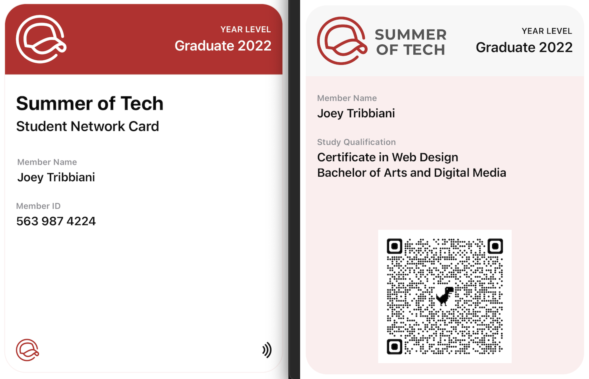
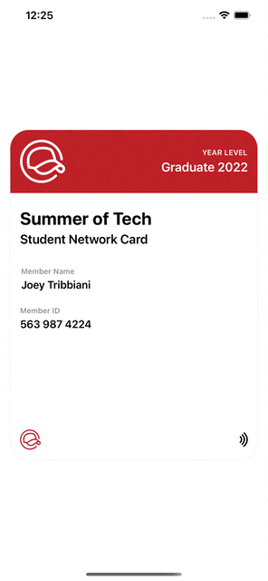

# SoT 2022 Bootcamp - Designer and Developer Collaboration

Hello there! This is the repository from the **2022 SoT Designer/Developer Collaboration bootcamp** written in **SwiftUI**. Feel free to fork/download and play around with it!

 

# Requirements

- Mac OS (sorry Windows & Linux users!)
- Xcode 13+

# FAQ

- **MainApp** is where you run the app from and where you can edit the data you want displayed.
- File order for debugging if stuck:
	- MainApp -> 
		- CardView -> 
			- NetworkCardViewModel -> 
				- NetworkCardFrontView + NetworkCardBackView
